# Projects and dependencies analysis

This document provides a comprehensive overview of the projects and their dependencies in the context of upgrading to .NET 9.0.

## Table of Contents

- [Projects Relationship Graph](#projects-relationship-graph)
- [Project Details](#project-details)

  - [MauiAnimations\MauiAnimations.csproj](#mauianimationsmauianimationscsproj)
  - [MauiBiometrics\MauiBiometrics.csproj](#mauibiometricsmauibiometricscsproj)
  - [MauiCamera\MauiCamera.csproj](#mauicameramauicameracsproj)
  - [MauiCollections\MauiCollections.csproj](#mauicollectionsmauicollectionscsproj)
  - [MAUICommunications\MAUICommunications.csproj](#mauicommunicationsmauicommunicationscsproj)
  - [MauiControls\MauiControls.csproj](#mauicontrolsmauicontrolscsproj)
  - [MauiDataBinding\MauiDataBinding.csproj](#mauidatabindingmauidatabindingcsproj)
  - [MauiDeviceOutput\MauiDeviceOutput.csproj](#mauideviceoutputmauideviceoutputcsproj)
  - [MauiDevices\MauiDevices.csproj](#mauidevicesmauidevicescsproj)
  - [MauiGeoLocation\MauiGeoLocation.csproj](#mauigeolocationmauigeolocationcsproj)
  - [MauiGraphics\MauiGraphics.csproj](#mauigraphicsmauigraphicscsproj)
  - [MauiLayouts\MauiLayouts.csproj](#mauilayoutsmauilayoutscsproj)
  - [MauiLocalization\MauiLocalization.csproj](#mauilocalizationmauilocalizationcsproj)
  - [MauiMedia\MauiMedia.csproj](#mauimediamauimediacsproj)
  - [MauiMvvm\MauiMvvm.csproj](#mauimvvmmauimvvmcsproj)
  - [MauiNavigation\MauiNavigation.csproj](#mauinavigationmauinavigationcsproj)
  - [MauiSensors\MauiSensors.csproj](#mauisensorsmauisensorscsproj)
  - [MauiStorage\MauiStorage.csproj](#mauistoragemauistoragecsproj)
- [Aggregate NuGet packages details](#aggregate-nuget-packages-details)

## Projects Relationship Graph

Legend:
📦 SDK-style project
⚙️ Classic project

```mermaid
flowchart LR
    P1["<b>📦&nbsp;MauiControls.csproj</b><br/><small>net9.0-android;net9.0-ios;net9.0-maccatalyst;net9.0-windows10.0.19041.0</small>"]
    P2["<b>📦&nbsp;MauiCollections.csproj</b><br/><small>net9.0-android;net9.0-ios;net9.0-maccatalyst;net9.0-windows10.0.19041.0</small>"]
    P3["<b>📦&nbsp;MauiDataBinding.csproj</b><br/><small>net9.0-android;net9.0-ios;net9.0-maccatalyst;net9.0-windows10.0.19041.0</small>"]
    P4["<b>📦&nbsp;MauiGraphics.csproj</b><br/><small>net9.0-android;net9.0-ios;net9.0-maccatalyst;net9.0-windows10.0.19041.0</small>"]
    P5["<b>📦&nbsp;MauiLayouts.csproj</b><br/><small>net9.0-android;net9.0-ios;net9.0-maccatalyst;net9.0-windows10.0.19041.0</small>"]
    P6["<b>📦&nbsp;MauiMvvm.csproj</b><br/><small>net9.0-android;net9.0-ios;net9.0-maccatalyst;net9.0-windows10.0.19041.0</small>"]
    P7["<b>📦&nbsp;MauiStorage.csproj</b><br/><small>net9.0-android;net9.0-ios;net9.0-maccatalyst;net9.0-windows10.0.19041.0</small>"]
    P8["<b>📦&nbsp;MauiDevices.csproj</b><br/><small>net9.0-android;net9.0-ios;net9.0-maccatalyst;net9.0-windows10.0.19041.0</small>"]
    P9["<b>📦&nbsp;MauiSensors.csproj</b><br/><small>net9.0-android;net9.0-ios;net9.0-maccatalyst;net9.0-windows10.0.19041.0</small>"]
    P10["<b>📦&nbsp;MauiNavigation.csproj</b><br/><small>net9.0-android;net9.0-ios;net9.0-maccatalyst;net9.0-windows10.0.19041.0</small>"]
    P11["<b>📦&nbsp;MauiGeoLocation.csproj</b><br/><small>net9.0-android;net9.0-ios;net9.0-maccatalyst;net9.0-windows10.0.19041.0</small>"]
    P12["<b>📦&nbsp;MauiDeviceOutput.csproj</b><br/><small>net9.0-android;net9.0-ios;net9.0-maccatalyst;net9.0-windows10.0.19041.0</small>"]
    P13["<b>📦&nbsp;MauiMedia.csproj</b><br/><small>net9.0-android;net9.0-ios;net9.0-maccatalyst;net9.0-windows10.0.19041.0</small>"]
    P14["<b>📦&nbsp;MauiAnimations.csproj</b><br/><small>net9.0-android;net9.0-ios;net9.0-maccatalyst;net9.0-windows10.0.19041.0</small>"]
    P15["<b>📦&nbsp;MauiLocalization.csproj</b><br/><small>net9.0-android;net9.0-ios;net9.0-maccatalyst;net9.0-windows10.0.19041.0</small>"]
    P16["<b>📦&nbsp;MauiCamera.csproj</b><br/><small>net9.0-android;net9.0-ios;net9.0-maccatalyst;net9.0-windows10.0.19041.0</small>"]
    P17["<b>📦&nbsp;MAUICommunications.csproj</b><br/><small>net9.0-android;net9.0-ios;net9.0-maccatalyst;net9.0-windows10.0.19041.0</small>"]
    P18["<b>📦&nbsp;MauiBiometrics.csproj</b><br/><small>net9.0-android;net9.0-ios;net9.0-maccatalyst;net9.0-windows10.0.19041.0</small>"]
    click P1 "#mauicontrolsmauicontrolscsproj"
    click P2 "#mauicollectionsmauicollectionscsproj"
    click P3 "#mauidatabindingmauidatabindingcsproj"
    click P4 "#mauigraphicsmauigraphicscsproj"
    click P5 "#mauilayoutsmauilayoutscsproj"
    click P6 "#mauimvvmmauimvvmcsproj"
    click P7 "#mauistoragemauistoragecsproj"
    click P8 "#mauidevicesmauidevicescsproj"
    click P9 "#mauisensorsmauisensorscsproj"
    click P10 "#mauinavigationmauinavigationcsproj"
    click P11 "#mauigeolocationmauigeolocationcsproj"
    click P12 "#mauideviceoutputmauideviceoutputcsproj"
    click P13 "#mauimediamauimediacsproj"
    click P14 "#mauianimationsmauianimationscsproj"
    click P15 "#mauilocalizationmauilocalizationcsproj"
    click P16 "#mauicameramauicameracsproj"
    click P17 "#mauicommunicationsmauicommunicationscsproj"
    click P18 "#mauibiometricsmauibiometricscsproj"

```

## Project Details

### MauiAnimations\MauiAnimations.csproj

#### Project Info

- **Current Target Framework:** net9.0-android;net9.0-ios;net9.0-maccatalyst;net9.0-windows10.0.19041.0✅
- **SDK-style**: True
- **Project Kind:** ClassLibrary
- **Dependencies**: 0
- **Dependants**: 0
- **Number of Files**: 14
- **Lines of Code**: 301

#### Dependency Graph

Legend:
📦 SDK-style project
⚙️ Classic project

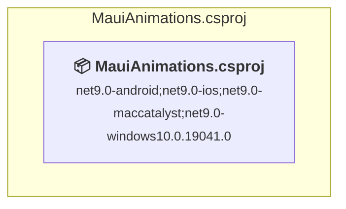

#### Project Package References

| Package | Type | Current Version | Suggested Version | Description |
| :--- | :---: | :---: | :---: | :--- |
| CommunityToolkit.Maui.Core | Explicit | 12.2.0 |  | ✅Compatible |
| Microsoft.Extensions.Logging.Debug | Explicit | 9.0.9 |  | ✅Compatible |
| Microsoft.Maui.Controls | Explicit | 9.0.110 |  | ✅Compatible |
| Microsoft.Maui.Controls.Compatibility | Explicit | 9.0.110 |  | ✅Compatible |

### MauiBiometrics\MauiBiometrics.csproj

#### Project Info

- **Current Target Framework:** net9.0-android;net9.0-ios;net9.0-maccatalyst;net9.0-windows10.0.19041.0✅
- **SDK-style**: True
- **Project Kind:** ClassLibrary
- **Dependencies**: 0
- **Dependants**: 0
- **Number of Files**: 12
- **Lines of Code**: 199

#### Dependency Graph

Legend:
📦 SDK-style project
⚙️ Classic project

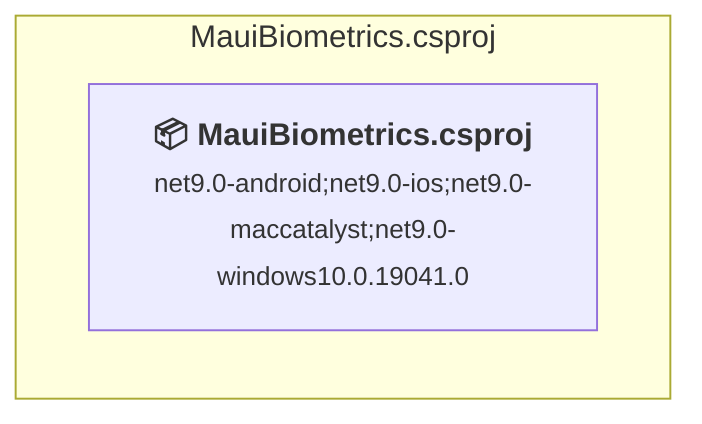

#### Project Package References

| Package | Type | Current Version | Suggested Version | Description |
| :--- | :---: | :---: | :---: | :--- |
| Microsoft.Extensions.Logging.Debug | Explicit | 9.0.9 |  | ✅Compatible |
| Microsoft.Maui.Controls | Explicit | 9.0.110 |  | ✅Compatible |
| Microsoft.Maui.Controls.Compatibility | Explicit | 9.0.110 |  | ✅Compatible |
| Oscore.Maui.Biometric | Explicit | 2.4.1 |  | ✅Compatible |

### MauiCamera\MauiCamera.csproj

#### Project Info

- **Current Target Framework:** net9.0-android;net9.0-ios;net9.0-maccatalyst;net9.0-windows10.0.19041.0✅
- **SDK-style**: True
- **Project Kind:** ClassLibrary
- **Dependencies**: 0
- **Dependants**: 0
- **Number of Files**: 17
- **Lines of Code**: 567

#### Dependency Graph

Legend:
📦 SDK-style project
⚙️ Classic project

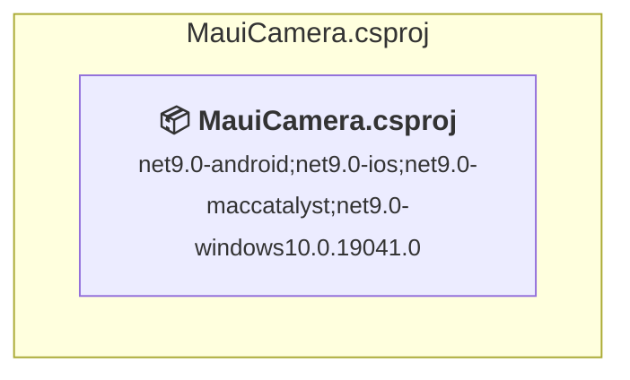

#### Project Package References

| Package | Type | Current Version | Suggested Version | Description |
| :--- | :---: | :---: | :---: | :--- |
| Camera.MAUI | Explicit | 1.5.1 |  | ✅Compatible |
| CommunityToolkit.Maui | Explicit | 11.2.0 |  | ✅Compatible |
| CommunityToolkit.Maui.Camera | Explicit | 2.0.3 |  | ✅Compatible |
| CommunityToolkit.Mvvm | Explicit | 8.4.0 |  | ✅Compatible |
| Microsoft.Extensions.Logging.Debug | Explicit | 9.0.5 |  | ✅Compatible |
| Microsoft.Maui.Controls | Explicit | 9.0.70 |  | ✅Compatible |
| Microsoft.Maui.Controls.Compatibility | Explicit | 9.0.70 |  | ✅Compatible |
| Plugin.Maui.OCR | Explicit | 1.0.15 |  | ✅Compatible |

### MauiCollections\MauiCollections.csproj

#### Project Info

- **Current Target Framework:** net9.0-android;net9.0-ios;net9.0-maccatalyst;net9.0-windows10.0.19041.0✅
- **SDK-style**: True
- **Project Kind:** ClassLibrary
- **Dependencies**: 0
- **Dependants**: 0
- **Number of Files**: 26
- **Lines of Code**: 699

#### Dependency Graph

Legend:
📦 SDK-style project
⚙️ Classic project

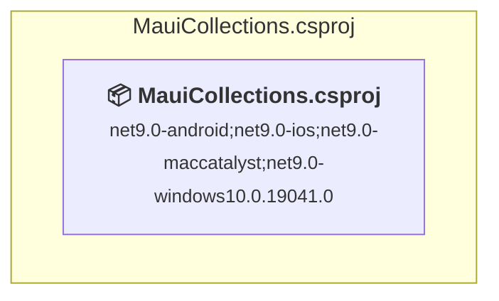

#### Project Package References

| Package | Type | Current Version | Suggested Version | Description |
| :--- | :---: | :---: | :---: | :--- |
| CommunityToolkit.Mvvm | Explicit | 8.4.0 |  | ✅Compatible |
| Microsoft.Extensions.Logging.Debug | Explicit | 9.0.5 |  | ✅Compatible |
| Microsoft.Maui.Controls | Explicit | 9.0.70 |  | ✅Compatible |
| Microsoft.Maui.Controls.Compatibility | Explicit | 9.0.70 |  | ✅Compatible |

### MAUICommunications\MAUICommunications.csproj

#### Project Info

- **Current Target Framework:** net9.0-android;net9.0-ios;net9.0-maccatalyst;net9.0-windows10.0.19041.0✅
- **SDK-style**: True
- **Project Kind:** ClassLibrary
- **Dependencies**: 0
- **Dependants**: 0
- **Number of Files**: 19
- **Lines of Code**: 431

#### Dependency Graph

Legend:
📦 SDK-style project
⚙️ Classic project

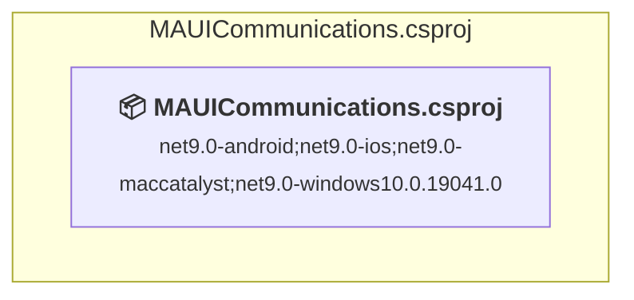

#### Project Package References

| Package | Type | Current Version | Suggested Version | Description |
| :--- | :---: | :---: | :---: | :--- |
| CommunityToolkit.Mvvm | Explicit | 8.4.0 |  | ✅Compatible |
| Microsoft.Extensions.Logging.Debug | Explicit | 9.0.5 |  | ✅Compatible |
| Microsoft.Maui.Controls | Explicit | 9.0.70 |  | ✅Compatible |
| Microsoft.Maui.Controls.Compatibility | Explicit | 9.0.70 |  | ✅Compatible |

### MauiControls\MauiControls.csproj

#### Project Info

- **Current Target Framework:** net9.0-android;net9.0-ios;net9.0-maccatalyst;net9.0-windows10.0.19041.0✅
- **SDK-style**: True
- **Project Kind:** ClassLibrary
- **Dependencies**: 0
- **Dependants**: 0
- **Number of Files**: 15
- **Lines of Code**: 340

#### Dependency Graph

Legend:
📦 SDK-style project
⚙️ Classic project

#### Project Package References

| Package | Type | Current Version | Suggested Version | Description |
| :--- | :---: | :---: | :---: | :--- |
| Microsoft.Extensions.Logging.Debug | Explicit | 9.0.9 |  | ✅Compatible |
| Microsoft.Maui.Controls | Explicit | 9.0.110 |  | ✅Compatible |
| Microsoft.Maui.Controls.Compatibility | Explicit | 9.0.110 |  | ✅Compatible |

### MauiDataBinding\MauiDataBinding.csproj

#### Project Info

- **Current Target Framework:** net9.0-android;net9.0-ios;net9.0-maccatalyst;net9.0-windows10.0.19041.0✅
- **SDK-style**: True
- **Project Kind:** ClassLibrary
- **Dependencies**: 0
- **Dependants**: 0
- **Number of Files**: 15
- **Lines of Code**: 338

#### Dependency Graph

Legend:
📦 SDK-style project
⚙️ Classic project

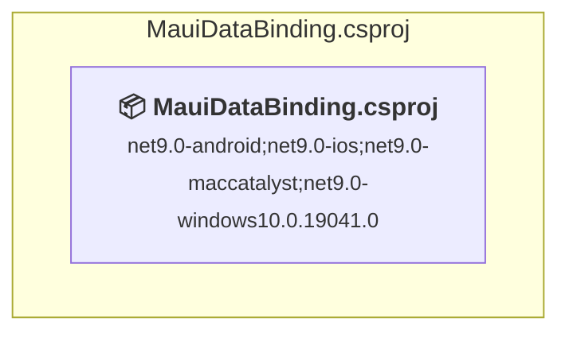

#### Project Package References

| Package | Type | Current Version | Suggested Version | Description |
| :--- | :---: | :---: | :---: | :--- |
| CommunityToolkit.Mvvm | Explicit | 8.4.0 |  | ✅Compatible |
| Microsoft.Extensions.Logging.Debug | Explicit | 9.0.5 |  | ✅Compatible |
| Microsoft.Maui.Controls | Explicit | 9.0.70 |  | ✅Compatible |
| Microsoft.Maui.Controls.Compatibility | Explicit | 9.0.70 |  | ✅Compatible |

### MauiDeviceOutput\MauiDeviceOutput.csproj

#### Project Info

- **Current Target Framework:** net9.0-android;net9.0-ios;net9.0-maccatalyst;net9.0-windows10.0.19041.0✅
- **SDK-style**: True
- **Project Kind:** ClassLibrary
- **Dependencies**: 0
- **Dependants**: 0
- **Number of Files**: 14
- **Lines of Code**: 250

#### Dependency Graph

Legend:
📦 SDK-style project
⚙️ Classic project

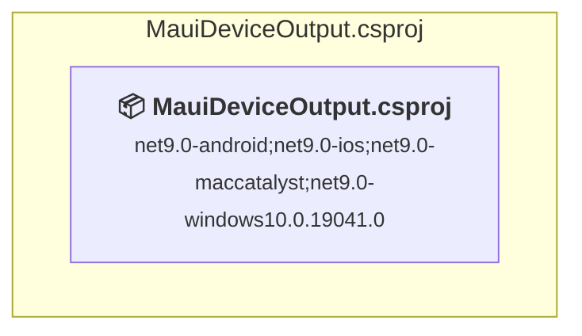

#### Project Package References

| Package | Type | Current Version | Suggested Version | Description |
| :--- | :---: | :---: | :---: | :--- |
| Microsoft.Extensions.Logging.Debug | Explicit | 9.0.5 |  | ✅Compatible |
| Microsoft.Maui.Controls | Explicit | 9.0.70 |  | ✅Compatible |
| Microsoft.Maui.Controls.Compatibility | Explicit | 9.0.70 |  | ✅Compatible |

### MauiDevices\MauiDevices.csproj

#### Project Info

- **Current Target Framework:** net9.0-android;net9.0-ios;net9.0-maccatalyst;net9.0-windows10.0.19041.0✅
- **SDK-style**: True
- **Project Kind:** ClassLibrary
- **Dependencies**: 0
- **Dependants**: 0
- **Number of Files**: 14
- **Lines of Code**: 336

#### Dependency Graph

Legend:
📦 SDK-style project
⚙️ Classic project

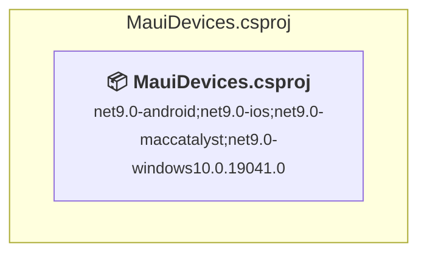

#### Project Package References

| Package | Type | Current Version | Suggested Version | Description |
| :--- | :---: | :---: | :---: | :--- |
| Microsoft.Extensions.Logging.Debug | Explicit | 9.0.5 |  | ✅Compatible |
| Microsoft.Maui.Controls | Explicit | 9.0.70 |  | ✅Compatible |
| Microsoft.Maui.Controls.Compatibility | Explicit | 9.0.70 |  | ✅Compatible |

### MauiGeoLocation\MauiGeoLocation.csproj

#### Project Info

- **Current Target Framework:** net9.0-android;net9.0-ios;net9.0-maccatalyst;net9.0-windows10.0.19041.0✅
- **SDK-style**: True
- **Project Kind:** ClassLibrary
- **Dependencies**: 0
- **Dependants**: 0
- **Number of Files**: 15
- **Lines of Code**: 462

#### Dependency Graph

Legend:
📦 SDK-style project
⚙️ Classic project

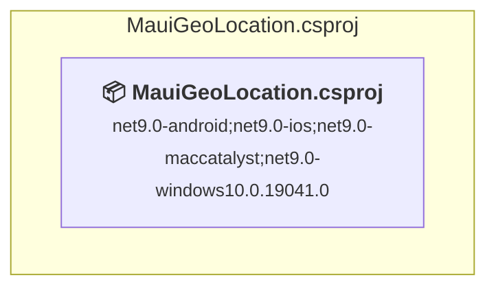

#### Project Package References

| Package | Type | Current Version | Suggested Version | Description |
| :--- | :---: | :---: | :---: | :--- |
| CommunityToolkit.Maui.Maps | Explicit | 3.0.2 |  | ✅Compatible |
| Microsoft.Extensions.Logging.Debug | Explicit | 9.0.5 |  | ✅Compatible |
| Microsoft.Maui.Controls | Explicit | 9.0.70 |  | ✅Compatible |
| Microsoft.Maui.Controls.Compatibility | Explicit | 9.0.70 |  | ✅Compatible |
| Microsoft.Maui.Controls.Maps | Explicit | 9.0.70 |  | ✅Compatible |

### MauiGraphics\MauiGraphics.csproj

#### Project Info

- **Current Target Framework:** net9.0-android;net9.0-ios;net9.0-maccatalyst;net9.0-windows10.0.19041.0✅
- **SDK-style**: True
- **Project Kind:** ClassLibrary
- **Dependencies**: 0
- **Dependants**: 0
- **Number of Files**: 21
- **Lines of Code**: 637

#### Dependency Graph

Legend:
📦 SDK-style project
⚙️ Classic project

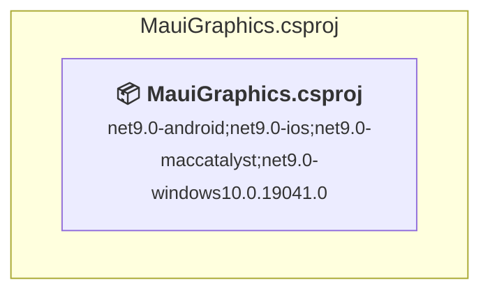

#### Project Package References

| Package | Type | Current Version | Suggested Version | Description |
| :--- | :---: | :---: | :---: | :--- |
| CommunityToolkit.Maui | Explicit | 12.2.0 |  | ✅Compatible |
| CommunityToolkit.Maui.Core | Explicit | 12.2.0 |  | ✅Compatible |
| Microsoft.Extensions.Logging.Debug | Explicit | 9.0.9 |  | ✅Compatible |
| Microsoft.Maui.Controls | Explicit | 9.0.110 |  | ✅Compatible |
| Microsoft.Maui.Controls.Compatibility | Explicit | 9.0.110 |  | ✅Compatible |
| SkiaSharp.Views.Maui.Controls | Explicit | 3.119.1 |  | ✅Compatible |
| ZXing.Net.Maui | Explicit | 0.5.2 |  | ✅Compatible |
| ZXing.Net.Maui.Controls | Explicit | 0.5.2 |  | ✅Compatible |

### MauiLayouts\MauiLayouts.csproj

#### Project Info

- **Current Target Framework:** net9.0-android;net9.0-ios;net9.0-maccatalyst;net9.0-windows10.0.19041.0✅
- **SDK-style**: True
- **Project Kind:** ClassLibrary
- **Dependencies**: 0
- **Dependants**: 0
- **Number of Files**: 18
- **Lines of Code**: 335

#### Dependency Graph

Legend:
📦 SDK-style project
⚙️ Classic project

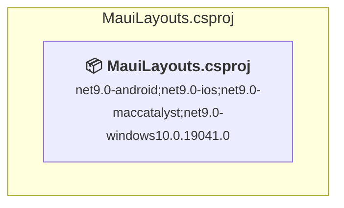

#### Project Package References

| Package | Type | Current Version | Suggested Version | Description |
| :--- | :---: | :---: | :---: | :--- |
| Microsoft.Extensions.Logging.Debug | Explicit | 9.0.5 |  | ✅Compatible |
| Microsoft.Maui.Controls | Explicit | 9.0.70 |  | ✅Compatible |
| Microsoft.Maui.Controls.Compatibility | Explicit | 9.0.70 |  | ✅Compatible |

### MauiLocalization\MauiLocalization.csproj

#### Project Info

- **Current Target Framework:** net9.0-android;net9.0-ios;net9.0-maccatalyst;net9.0-windows10.0.19041.0✅
- **SDK-style**: True
- **Project Kind:** ClassLibrary
- **Dependencies**: 0
- **Dependants**: 0
- **Number of Files**: 16
- **Lines of Code**: 354

#### Dependency Graph

Legend:
📦 SDK-style project
⚙️ Classic project

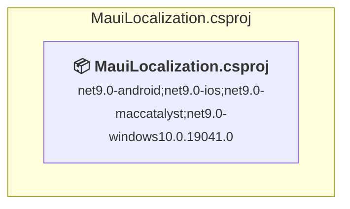

#### Project Package References

| Package | Type | Current Version | Suggested Version | Description |
| :--- | :---: | :---: | :---: | :--- |
| Microsoft.Extensions.Logging.Debug | Explicit | 9.0.0 |  | ✅Compatible |
| Microsoft.Extensions.Logging.Debug | Explicit | 9.0.5 |  | ✅Compatible |
| Microsoft.Maui.Controls | Explicit | 9.0.70 |  | ✅Compatible |
| Microsoft.Maui.Controls.Compatibility | Explicit | 9.0.70 |  | ✅Compatible |

### MauiMedia\MauiMedia.csproj

#### Project Info

- **Current Target Framework:** net9.0-android;net9.0-ios;net9.0-maccatalyst;net9.0-windows10.0.19041.0✅
- **SDK-style**: True
- **Project Kind:** ClassLibrary
- **Dependencies**: 0
- **Dependants**: 0
- **Number of Files**: 19
- **Lines of Code**: 665

#### Dependency Graph

Legend:
📦 SDK-style project
⚙️ Classic project

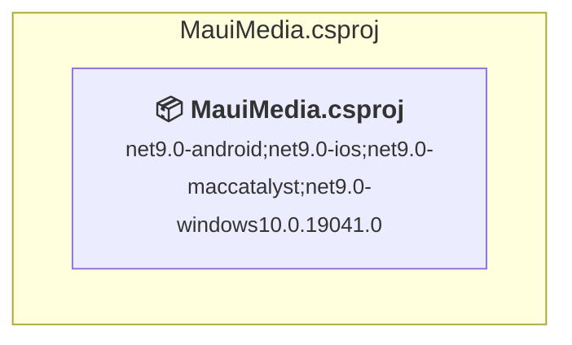

#### Project Package References

| Package | Type | Current Version | Suggested Version | Description |
| :--- | :---: | :---: | :---: | :--- |
| CommunityToolkit.Maui | Explicit | 11.2.0 |  | ✅Compatible |
| CommunityToolkit.Maui.MediaElement | Explicit | 6.0.2 |  | ✅Compatible |
| CommunityToolkit.Mvvm | Explicit | 8.4.0 |  | ✅Compatible |
| Microsoft.Extensions.Logging.Debug | Explicit | 9.0.5 |  | ✅Compatible |
| Microsoft.Maui.Controls | Explicit | 9.0.70 |  | ✅Compatible |
| Microsoft.Maui.Controls.Compatibility | Explicit | 9.0.70 |  | ✅Compatible |
| Plugin.Maui.Audio | Explicit | 3.1.1 |  | ✅Compatible |
| ZXing.Net.Maui | Explicit | 0.4.0 |  | ✅Compatible |
| ZXing.Net.Maui.Controls | Explicit | 0.4.0 |  | ✅Compatible |

### MauiMvvm\MauiMvvm.csproj

#### Project Info

- **Current Target Framework:** net9.0-android;net9.0-ios;net9.0-maccatalyst;net9.0-windows10.0.19041.0✅
- **SDK-style**: True
- **Project Kind:** ClassLibrary
- **Dependencies**: 0
- **Dependants**: 0
- **Number of Files**: 16
- **Lines of Code**: 390

#### Dependency Graph

Legend:
📦 SDK-style project
⚙️ Classic project

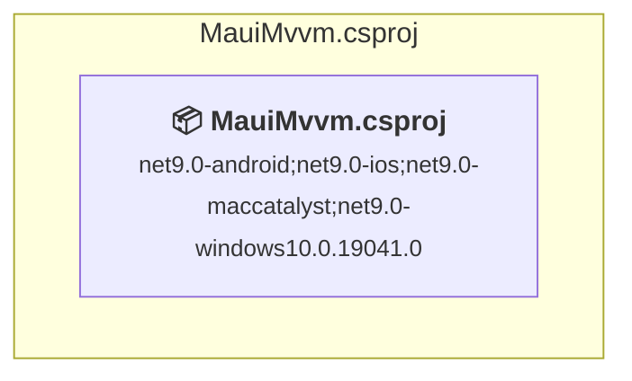

#### Project Package References

| Package | Type | Current Version | Suggested Version | Description |
| :--- | :---: | :---: | :---: | :--- |
| CommunityToolkit.Mvvm | Explicit | 8.4.0 |  | ✅Compatible |
| Microsoft.Extensions.Logging.Debug | Explicit | 9.0.9 |  | ✅Compatible |
| Microsoft.Maui.Controls | Explicit | 9.0.110 |  | ✅Compatible |
| Microsoft.Maui.Controls.Compatibility | Explicit | 9.0.110 |  | ✅Compatible |

### MauiNavigation\MauiNavigation.csproj

#### Project Info

- **Current Target Framework:** net9.0-android;net9.0-ios;net9.0-maccatalyst;net9.0-windows10.0.19041.0✅
- **SDK-style**: True
- **Project Kind:** ClassLibrary
- **Dependencies**: 0
- **Dependants**: 0
- **Number of Files**: 21
- **Lines of Code**: 764

#### Dependency Graph

Legend:
📦 SDK-style project
⚙️ Classic project

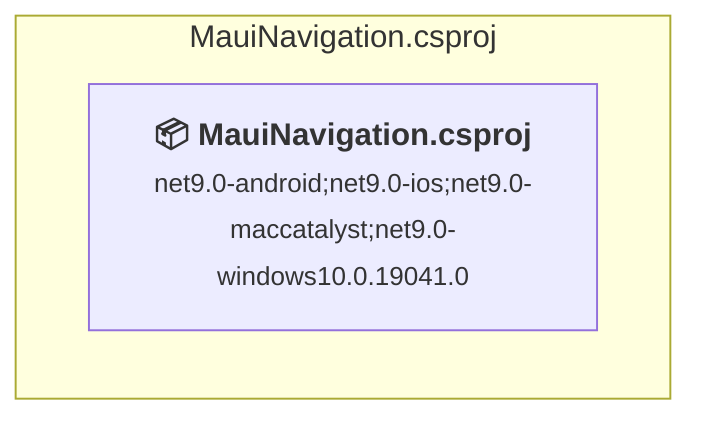

#### Project Package References

| Package | Type | Current Version | Suggested Version | Description |
| :--- | :---: | :---: | :---: | :--- |
| CommunityToolkit.Maui | Explicit | 11.2.0 |  | ✅Compatible |
| CommunityToolkit.Mvvm | Explicit | 8.4.0 |  | ✅Compatible |
| Microsoft.Extensions.Logging.Debug | Explicit | 9.0.5 |  | ✅Compatible |
| Microsoft.Maui.Controls | Explicit | 9.0.70 |  | ✅Compatible |
| Microsoft.Maui.Controls.Compatibility | Explicit | 9.0.70 |  | ✅Compatible |

### MauiSensors\MauiSensors.csproj

#### Project Info

- **Current Target Framework:** net9.0-android;net9.0-ios;net9.0-maccatalyst;net9.0-windows10.0.19041.0✅
- **SDK-style**: True
- **Project Kind:** ClassLibrary
- **Dependencies**: 0
- **Dependants**: 0
- **Number of Files**: 21
- **Lines of Code**: 636

#### Dependency Graph

Legend:
📦 SDK-style project
⚙️ Classic project

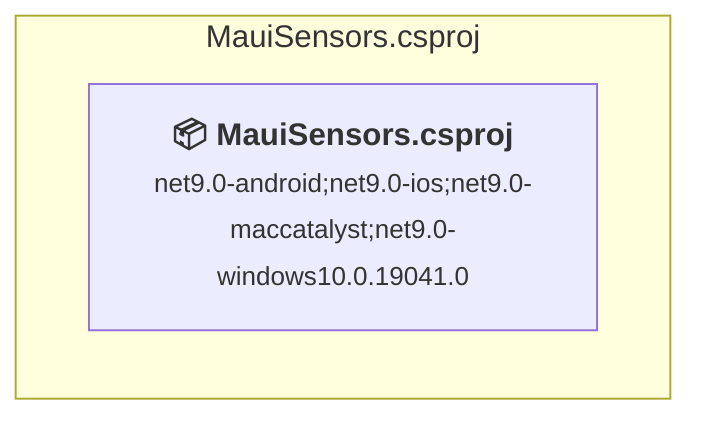

#### Project Package References

| Package | Type | Current Version | Suggested Version | Description |
| :--- | :---: | :---: | :---: | :--- |
| Microsoft.Extensions.Logging.Debug | Explicit | 9.0.9 |  | ✅Compatible |
| Microsoft.Maui.Controls | Explicit | 9.0.110 |  | ✅Compatible |
| Microsoft.Maui.Controls.Compatibility | Explicit | 9.0.110 |  | ✅Compatible |

### MauiStorage\MauiStorage.csproj

#### Project Info

- **Current Target Framework:** net9.0-android;net9.0-ios;net9.0-maccatalyst;net9.0-windows10.0.19041.0✅
- **SDK-style**: True
- **Project Kind:** ClassLibrary
- **Dependencies**: 0
- **Dependants**: 0
- **Number of Files**: 14
- **Lines of Code**: 277

#### Dependency Graph

Legend:
📦 SDK-style project
⚙️ Classic project

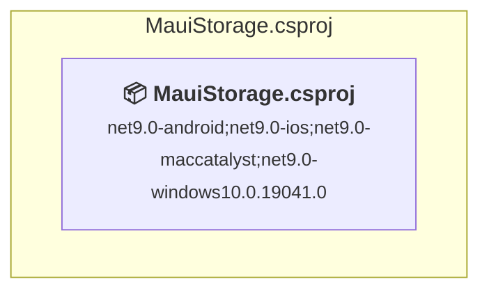

#### Project Package References

| Package | Type | Current Version | Suggested Version | Description |
| :--- | :---: | :---: | :---: | :--- |
| Microsoft.Extensions.Logging.Debug | Explicit | 9.0.9 |  | ✅Compatible |
| Microsoft.Maui.Controls | Explicit | 9.0.110 |  | ✅Compatible |
| Microsoft.Maui.Controls.Compatibility | Explicit | 9.0.110 |  | ✅Compatible |

## Aggregate NuGet packages details

| Package | Current Version | Suggested Version | Projects | Description |
| :--- | :---: | :---: | :--- | :--- |
| Camera.MAUI | 1.5.1 |  | [MauiCamera.csproj](#mauicameracsproj) | ✅Compatible |
| CommunityToolkit.Maui | 11.2.0 |  | [MauiCamera.csproj](#mauicameracsproj) [MauiMedia.csproj](#mauimediacsproj) [MauiNavigation.csproj](#mauinavigationcsproj) | ✅Compatible |
| CommunityToolkit.Maui | 12.2.0 |  | [MauiGraphics.csproj](#mauigraphicscsproj) | ✅Compatible |
| CommunityToolkit.Maui.Camera | 2.0.3 |  | [MauiCamera.csproj](#mauicameracsproj) | ✅Compatible |
| CommunityToolkit.Maui.Core | 12.2.0 |  | [MauiAnimations.csproj](#mauianimationscsproj) [MauiGraphics.csproj](#mauigraphicscsproj) | ✅Compatible |
| CommunityToolkit.Maui.Maps | 3.0.2 |  | [MauiGeoLocation.csproj](#mauigeolocationcsproj) | ✅Compatible |
| CommunityToolkit.Maui.MediaElement | 6.0.2 |  | [MauiMedia.csproj](#mauimediacsproj) | ✅Compatible |
| CommunityToolkit.Mvvm | 8.4.0 |  | [MauiCamera.csproj](#mauicameracsproj) [MauiCollections.csproj](#mauicollectionscsproj) [MAUICommunications.csproj](#mauicommunicationscsproj) [MauiDataBinding.csproj](#mauidatabindingcsproj) [MauiMedia.csproj](#mauimediacsproj) [MauiMvvm.csproj](#mauimvvmcsproj) [MauiNavigation.csproj](#mauinavigationcsproj) | ✅Compatible |
| Microsoft.Extensions.Logging.Debug | 9.0.0 |  | [MauiLocalization.csproj](#mauilocalizationcsproj) | ✅Compatible |
| Microsoft.Extensions.Logging.Debug | 9.0.5 |  | [MauiCamera.csproj](#mauicameracsproj) [MauiCollections.csproj](#mauicollectionscsproj) [MAUICommunications.csproj](#mauicommunicationscsproj) [MauiDataBinding.csproj](#mauidatabindingcsproj) [MauiDeviceOutput.csproj](#mauideviceoutputcsproj) [MauiDevices.csproj](#mauidevicescsproj) [MauiGeoLocation.csproj](#mauigeolocationcsproj) [MauiLayouts.csproj](#mauilayoutscsproj) [MauiLocalization.csproj](#mauilocalizationcsproj) [MauiMedia.csproj](#mauimediacsproj) [MauiNavigation.csproj](#mauinavigationcsproj) | ✅Compatible |
| Microsoft.Extensions.Logging.Debug | 9.0.9 |  | [MauiAnimations.csproj](#mauianimationscsproj) [MauiBiometrics.csproj](#mauibiometricscsproj) [MauiControls.csproj](#mauicontrolscsproj) [MauiGraphics.csproj](#mauigraphicscsproj) [MauiMvvm.csproj](#mauimvvmcsproj) [MauiSensors.csproj](#mauisensorscsproj) [MauiStorage.csproj](#mauistoragecsproj) | ✅Compatible |
| Microsoft.Maui.Controls | 9.0.110 |  | [MauiAnimations.csproj](#mauianimationscsproj) [MauiBiometrics.csproj](#mauibiometricscsproj) [MauiControls.csproj](#mauicontrolscsproj) [MauiGraphics.csproj](#mauigraphicscsproj) [MauiMvvm.csproj](#mauimvvmcsproj) [MauiSensors.csproj](#mauisensorscsproj) [MauiStorage.csproj](#mauistoragecsproj) | ✅Compatible |
| Microsoft.Maui.Controls | 9.0.70 |  | [MauiCamera.csproj](#mauicameracsproj) [MauiCollections.csproj](#mauicollectionscsproj) [MAUICommunications.csproj](#mauicommunicationscsproj) [MauiDataBinding.csproj](#mauidatabindingcsproj) [MauiDeviceOutput.csproj](#mauideviceoutputcsproj) [MauiDevices.csproj](#mauidevicescsproj) [MauiGeoLocation.csproj](#mauigeolocationcsproj) [MauiLayouts.csproj](#mauilayoutscsproj) [MauiLocalization.csproj](#mauilocalizationcsproj) [MauiMedia.csproj](#mauimediacsproj) [MauiNavigation.csproj](#mauinavigationcsproj) | ✅Compatible |
| Microsoft.Maui.Controls.Compatibility | 9.0.110 |  | [MauiAnimations.csproj](#mauianimationscsproj) [MauiBiometrics.csproj](#mauibiometricscsproj) [MauiControls.csproj](#mauicontrolscsproj) [MauiGraphics.csproj](#mauigraphicscsproj) [MauiMvvm.csproj](#mauimvvmcsproj) [MauiSensors.csproj](#mauisensorscsproj) [MauiStorage.csproj](#mauistoragecsproj) | ✅Compatible |
| Microsoft.Maui.Controls.Compatibility | 9.0.70 |  | [MauiCamera.csproj](#mauicameracsproj) [MauiCollections.csproj](#mauicollectionscsproj) [MAUICommunications.csproj](#mauicommunicationscsproj) [MauiDataBinding.csproj](#mauidatabindingcsproj) [MauiDeviceOutput.csproj](#mauideviceoutputcsproj) [MauiDevices.csproj](#mauidevicescsproj) [MauiGeoLocation.csproj](#mauigeolocationcsproj) [MauiLayouts.csproj](#mauilayoutscsproj) [MauiLocalization.csproj](#mauilocalizationcsproj) [MauiMedia.csproj](#mauimediacsproj) [MauiNavigation.csproj](#mauinavigationcsproj) | ✅Compatible |
| Microsoft.Maui.Controls.Maps | 9.0.70 |  | [MauiGeoLocation.csproj](#mauigeolocationcsproj) | ✅Compatible |
| Oscore.Maui.Biometric | 2.4.1 |  | [MauiBiometrics.csproj](#mauibiometricscsproj) | ✅Compatible |
| Plugin.Maui.Audio | 3.1.1 |  | [MauiMedia.csproj](#mauimediacsproj) | ✅Compatible |
| Plugin.Maui.OCR | 1.0.15 |  | [MauiCamera.csproj](#mauicameracsproj) | ✅Compatible |
| SkiaSharp.Views.Maui.Controls | 3.119.1 |  | [MauiGraphics.csproj](#mauigraphicscsproj) | ✅Compatible |
| ZXing.Net.Maui | 0.4.0 |  | [MauiMedia.csproj](#mauimediacsproj) | ✅Compatible |
| ZXing.Net.Maui | 0.5.2 |  | [MauiGraphics.csproj](#mauigraphicscsproj) | ✅Compatible |
| ZXing.Net.Maui.Controls | 0.4.0 |  | [MauiMedia.csproj](#mauimediacsproj) | ✅Compatible |
| ZXing.Net.Maui.Controls | 0.5.2 |  | [MauiGraphics.csproj](#mauigraphicscsproj) | ✅Compatible |

